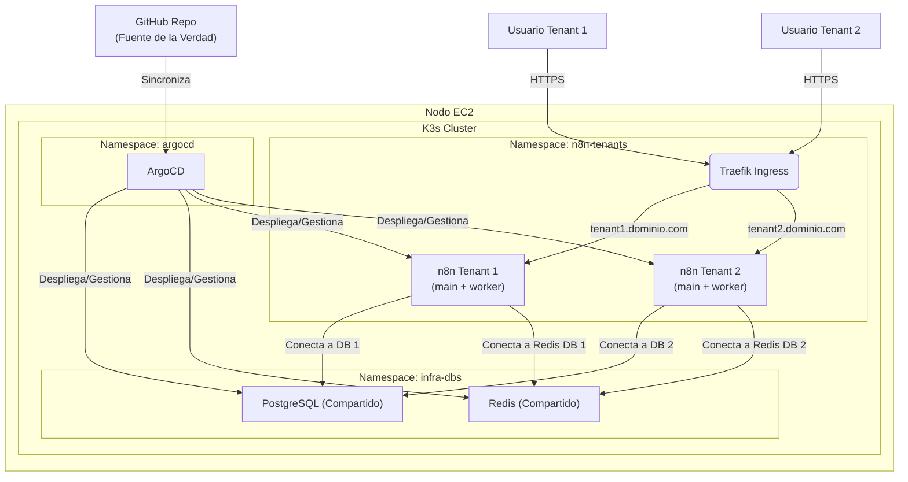

# Proyecto SaaS Multi-Tenant de n8n con K3s, ArgoCD y GitOps

Este documento describe la arquitectura y el despliegue de una plataforma SaaS para n8n, diseñada para ser robusta, escalable y gestionada enteramente a través de principios GitOps.

## 1. Visión General de la Arquitectura

El objetivo es desplegar múltiples instancias de n8n para diferentes inquilinos (tenants) en un único clúster de Kubernetes, optimizando el uso de recursos al compartir componentes de base de datos.

**Componentes Clave:**

*   **Host:** Una única instancia EC2 de tamaño considerable.
*   **Kubernetes:** Se ha elegido **K3s** por ser una distribución ligera, certificada por la CNCF y perfecta para producción en entornos de un solo nodo. Incluye componentes esenciales como Traefik (Ingress Controller) y Containerd.
*   **Bases de Datos Compartidas:** Una única instancia de **PostgreSQL** y **Redis** para todos los tenants, pero con bases de datos lógicamente separadas para garantizar el aislamiento.
*   **Gestión de Despliegues (CD):** **ArgoCD** se utilizará para la entrega continua, sincronizando el estado del clúster con los manifiestos declarados en este repositorio de Git (el principio de GitOps).
*   **Integración Continua (CI):** **GitHub Actions** se usará para tareas de validación y linting de los manifiestos antes de que se fusionen a la rama principal.
*   **Aislamiento de Tenants:** Cada instancia de n8n se ejecutará en su propio conjunto de Pods (main + worker) dentro de un namespace compartido, y será accesible a través de un subdominio único (ej. `tenant1.tu-dominio.com`).

**Diagrama de Flujo Lógico:**




## 2. Prerrequisitos

1.  **Instancia EC2:** Se recomienda una instancia con al menos 8 vCPU y 32 GB de RAM para empezar (ej. `t3.2xlarge` o similar).
2.  **Dominio:** Un nombre de dominio propio para apuntar a tus servicios.
3.  **DNS Wildcard:** Configura un registro DNS de tipo `A` wildcard (`*.n8n.tu-dominio.com`) que apunte a la IP pública de tu instancia EC2.
4.  **Repositorio en GitHub:** Un repositorio para alojar todos tus manifiestos de Kubernetes.

## 3. Paso a Paso: Implementación

### Paso 1: Instalación y Configuración de K3s

K3s es increíblemente sencillo de instalar. Conéctate a tu instancia EC2 por SSH y ejecuta el siguiente comando:

```bash
# Descarga e instala K3s
curl -sfL https://get.k3s.io | sh -

# Espera unos segundos a que el servicio se inicie...

# Verifica que el nodo esté listo
sudo k3s kubectl get node
```

Para poder usar `kubectl` desde tu máquina local (recomendado), copia el archivo de configuración de K3s de tu instancia EC2 (`/etc/rancher/k3s/k3s.yaml`) a tu máquina local en `~/.kube/config`. Recuerda reemplazar la IP del servidor `127.0.0.1` por la IP pública de tu EC2.

### Paso 2: Instalación de ArgoCD

ArgoCD se encargará de mantener nuestro clúster sincronizado con el repositorio de Git.

```bash
# 1. Crear el namespace para ArgoCD
kubectl create namespace argocd

# 2. Aplicar el manifiesto de instalación oficial
kubectl apply -n argocd -f https://raw.githubusercontent.com/argoproj/argo-cd/stable/manifests/install.yaml

# 3. (Opcional) Acceder a la UI a través de un port-forward
# Esto te permitirá configurar el repositorio inicial y ver el estado
kubectl port-forward svc/argocd-server -n argocd 8080:443

# 4. Obtener la contraseña inicial
kubectl -n argocd get secret argocd-initial-admin-secret -o jsonpath="{.data.password}" | base64 -d; echo
```

Accede a `https://localhost:8080`, inicia sesión con el usuario `admin` y la contraseña obtenida. Es recomendable que conectes tu repositorio de GitHub a ArgoCD a través de la UI o la CLI.

### Paso 3: Estructura del Repositorio de Manifiestos

La clave de un buen sistema GitOps es una estructura de repositorio lógica y predecible. Te propongo la siguiente:

```
.
├── namespaces
│   │   ├── platform-namespace.yaml
│   │   ├── n8n-namespace.yaml
│   │   └── argocd-namespace.yaml
│   ├── platform
│   │   ├── postgres
│   │   │   ├── postgres-secret.yaml
│   │   │   ├── postgres-statefulset.yaml
│   │   │   └── postgres-service.yaml
│   │   └── redis
│   │       ├── redis-statefulset.yaml
│   │       └── redis-service.yaml
│   ├── n8n
│   │   ├── config
│   │   │   └── n8n-common-configmap.yaml
│   │   ├── tenant-a
│   │   │   ├── n8n-tenant-a-secret.yaml
│   │   │   ├── n8n-tenant-a-main-deployment.yaml
│   │   │   ├── n8n-tenant-a-worker-deployment.yaml
│   │   │   ├── n8n-tenant-a-service.yaml
│   │   │   └── n8n-tenant-a-ingress.yaml
│   │   └── tenant-b
│   │       ├── n8n-tenant-b-secret.yaml
│   │       ├── n8n-tenant-b-main-deployment.yaml
│   │       ├── n8n-tenant-b-worker-deployment.yaml
│   │       ├── n8n-tenant-b-service.yaml
│   │       └── n8n-tenant-b-ingress.yaml
│   └── argocd
│       └── application-n8n-saas.yaml
```

### Paso 4: Despliegue de la Infraestructura Compartida (Postgres y Redis)

Vamos a crear una "umbrella app" en ArgoCD que desplegará y gestionará nuestras bases de datos compartidas.

**1. Archivos para la infraestructura (`infrastructure/dbs`)**

Usaremos los robustos Helm charts de Bitnami como base.

`infrastructure/dbs/Chart.yaml`:
```yaml
apiVersion: v2
name: infra-dbs
description: A chart for deploying shared PostgreSQL and Redis.
type: application
version: 0.1.0
appVersion: "1.0"
```

`infrastructure/dbs/values.yaml`:
```yaml
# Valores para el Helm Chart de PostgreSQL de Bitnami
postgresql:
  # Desplegamos PostgreSQL usando el chart de Bitnami
  enabled: true
  image:
    repository: bitnami/postgresql
    tag: 14.5.0
  auth:
    database: "n8n_template" # Una DB por defecto
    username: "postgres_admin"
    # IMPORTANTE: Cambiar esta contraseña y guardarla en un gestor de secretos.
    # Para este ejemplo, la ponemos aquí, pero en producción usa un secreto de K8s.
    password: "TuPasswordSuperSeguraParaPostgres"
  primary:
    persistence:
      enabled: true
      size: 20Gi # Ajustar según necesidades

# Valores para el Helm Chart de Redis de Bitnami
redis:
  # Desplegamos Redis usando el chart de Bitnami
  enabled: true
  image:
    repository: bitnami/redis
    tag: 6.2.7
  auth:
    # IMPORTANTE: Cambiar esta contraseña
    password: "TuPasswordSuperSeguraParaRedis"
  master:
    persistence:
      enabled: true
      size: 5Gi # Ajustar según necesidades```

`infrastructure/dbs/templates/postgres.yaml`:
```yaml
{{- if .Values.postgresql.enabled }}
apiVersion: argoproj.io/v1alpha1
kind: Application
metadata:
  name: postgresql
  namespace: argocd
  finalizers:
    - resources-finalizer.argocd.argoproj.io
spec:
  project: default
  destination:
    server: https://kubernetes.default.svc
    namespace: infra-dbs
  source:
    chart: postgresql
    repoURL: https://charts.bitnami.com/bitnami
    targetRevision: 11.9.13 # Versión estable del chart
    helm:
      values: |
        image:
          tag: {{ .Values.postgresql.image.tag }}
        auth:
          database: {{ .Values.postgresql.auth.database }}
          username: {{ .Values.postgresql.auth.username }}
          password: {{ .Values.postgresql.auth.password }}
        primary:
          persistence:
            enabled: {{ .Values.postgresql.primary.persistence.enabled }}
            size: {{ .Values.postgresql.primary.persistence.size }}
  syncPolicy:
    automated:
      prune: true
      selfHeal: true
    syncOptions:
    - CreateNamespace=true
{{- end }}
```

`infrastructure/dbs/templates/redis.yaml`:
```yaml
{{- if .Values.redis.enabled }}
apiVersion: argoproj.io/v1alpha1
kind: Application
metadata:
  name: redis
  namespace: argocd
  finalizers:
    - resources-finalizer.argoproj.io
spec:
  project: default
  destination:
    server: https://kubernetes.default.svc
    namespace: infra-dbs
  source:
    chart: redis
    repoURL: https://charts.bitnami.com/bitnami
    targetRevision: 16.13.2 # Versión estable del chart
    helm:
      values: |
        image:
          tag: {{ .Values.redis.image.tag }}
        auth:
          enabled: true
          password: {{ .Values.redis.auth.password }}
        master:
          persistence:
            enabled: {{ .Values.redis.master.persistence.enabled }}
            size: {{ .Values.redis.master.persistence.size }}
  syncPolicy:
    automated:
      prune: true
      selfHeal: true
    syncOptions:
    - CreateNamespace=true
{{- end }}
```

**2. Definición de la App en ArgoCD (`argocd-apps/infra-dbs.yaml`)**

Este manifiesto le dice a ArgoCD que despliegue nuestro chart de infraestructura.

```yaml
apiVersion: argoproj.io/v1alpha1
kind: Application
metadata:
  name: infra-dbs
  namespace: argocd
spec:
  project: default
  source:
    repoURL: 'URL_DE_TU_REPO_GITHUB' # <-- REEMPLAZAR
    path: infrastructure/dbs
    targetRevision: HEAD
  destination:
    server: 'https://kubernetes.default.svc'
    namespace: infra-dbs # Desplegará en este namespace
  syncPolicy:
    automated:
      prune: true
      selfHeal: true
    syncOptions:
    - CreateNamespace=true
```

Una vez que apliques este archivo (`kubectl apply -f argocd-apps/infra-dbs.yaml`), ArgoCD desplegará Postgres y Redis.

**3. Creación manual de las bases de datos para los tenants**

Por simplicidad, este plan requiere la creación manual de las BBDD y usuarios para cada tenant. Conéctate al pod de Postgres y crea las bases de datos y usuarios necesarios.

```bash
# Conectarse al pod de postgres
kubectl exec -it -n infra-dbs statefulset/postgresql-primary -- psql -U postgres_admin -d n8n_template

# En la shell de psql, ejecuta:
CREATE DATABASE n8n_tenant1;
CREATE USER user_tenant1 WITH PASSWORD 'PasswordSeguroTenant1';
GRANT ALL PRIVILEGES ON DATABASE n8n_tenant1 TO user_tenant1;

CREATE DATABASE n8n_tenant2;
CREATE USER user_tenant2 WITH PASSWORD 'PasswordSeguroTenant2';
GRANT ALL PRIVILEGES ON DATABASE n8n_tenant2 TO user_tenant2;
\q
```

### Paso 5: Despliegue de las Instancias de n8n (App of Apps)

Este patrón es ideal para gestionar múltiples aplicaciones similares. Crearemos una "App" principal en ArgoCD que buscará y desplegará todas las definiciones de tenants que encuentre en el directorio `tenants/`.

**1. App Maestra (`argocd-apps/app-of-apps.yaml`)**

```yaml
apiVersion: argoproj.io/v1alpha1
kind: Application
metadata:
  name: n8n-tenants-manager
  namespace: argocd
spec:
  project: default
  source:
    repoURL: 'URL_DE_TU_REPO_GITHUB' # <-- REEMPLAZAR
    targetRevision: HEAD
    directory:
      recurse: true
      jsonnet: {}
  destination:
    server: https://kubernetes.default.svc
    namespace: n8n-tenants # Namespace por defecto, cada app lo puede sobreescribir
  syncPolicy:
    automated:
      prune: true
      selfHeal: true
```

**2. Definición del Tenant 1 (`tenants/tenant1.yaml`)**

Este archivo contiene la `Application` de ArgoCD que despliega la instancia de n8n para el primer tenant. Toda la configuración se inyecta directamente a través del bloque `helm.values`.

```yaml
apiVersion: argoproj.io/v1alpha1
kind: Application
metadata:
  name: n8n-tenant1
  namespace: argocd
  finalizers:
    - resources-finalizer.argocd.argoproj.io
spec:
  project: default
  destination:
    server: https://kubernetes.default.svc
    namespace: n8n-tenants
  source:
    chart: n8n
    repoURL: https://community-charts.github.io/helm-charts
    targetRevision: 1.16.1 # Usar la versión del chart que analizaste
    helm:
      values: |
        image:
          tag: 1.119.1 # Versión de n8n
        
        # --- Configuración General ---
        # Es crucial para que los workers y webhooks esperen a que la DB esté migrada por el main pod
        worker:
          waitMainNodeReady:
            enabled: true
        webhook:
          waitMainNodeReady:
            enabled: true

        # --- Conexión a Base de Datos Compartida ---
        db:
          type: postgresdb
        
        externalPostgresql:
          host: "postgresql-primary.infra-dbs.svc.cluster.local"
          port: 5432
          username: "user_tenant1"
          password: "PasswordSeguroTenant1"
          database: "n8n_tenant1"
          existingSecret: "" # No usamos un secreto existente, pasamos las credenciales aquí
        
        # Deshabilitamos el chart de Postgres que viene con n8n
        postgresql:
          enabled: false

        # --- Configuración del Modo Queue y Redis ---
        worker:
          mode: queue
          count: 1 # Un solo pod worker como se pidió
        
        webhook:
          mode: queue

        externalRedis:
          host: "redis-master.infra-dbs.svc.cluster.local"
          port: 6379
          password: "TuPasswordSuperSeguraParaRedis"
          database: 1 # Base de datos lógica para este tenant (0-15)

        # Deshabilitamos el chart de Redis que viene con n8n
        redis:
          enabled: false
          
        # --- Configuración de Ingress (Acceso Externo) ---
        ingress:
          enabled: true
          # K3s usa Traefik, que puede funcionar bien con la clase de ingress por defecto
          # className: nginx # Si usaras Nginx Ingress
          hosts:
            - host: tenant1.n8n.tu-dominio.com # <-- REEMPLAZAR
              paths:
                - path: /
                  pathType: Prefix
        
        main:
          count: 1 # Un solo pod main
          resources:
            requests:
              cpu: 250m
              memory: 512Mi
            limits:
              cpu: 1000m
              memory: 1Gi
        
        worker:
          resources:
            requests:
              cpu: 250m
              memory: 512Mi
            limits:
              cpu: 1000m
              memory: 1Gi
  syncPolicy:
    automated:
      prune: true
      selfHeal: true
    syncOptions:
      - CreateNamespace=true
```

**3. Definición del Tenant 2 (`tenants/tenant2.yaml`)**

Es idéntico al del tenant 1, solo cambian los valores específicos del tenant.

```yaml
apiVersion: argoproj.io/v1alpha1
kind: Application
metadata:
  name: n8n-tenant2
  namespace: argocd
  finalizers:
    - resources-finalizer.argocd.argoproj.io
spec:
  project: default
  destination:
    server: https://kubernetes.default.svc
    namespace: n8n-tenants
  source:
    chart: n8n
    repoURL: https://community-charts.github.io/helm-charts
    targetRevision: 1.16.1
    helm:
      values: |
        image:
          tag: 1.119.1

        worker:
          waitMainNodeReady:
            enabled: true
        webhook:
          waitMainNodeReady:
            enabled: true

        db:
          type: postgresdb
        
        externalPostgresql:
          host: "postgresql-primary.infra-dbs.svc.cluster.local"
          port: 5432
          username: "user_tenant2"
          password: "PasswordSeguroTenant2"
          database: "n8n_tenant2"
        
        postgresql:
          enabled: false

        worker:
          mode: queue
          count: 1
        
        webhook:
          mode: queue

        externalRedis:
          host: "redis-master.infra-dbs.svc.cluster.local"
          port: 6379
          password: "TuPasswordSuperSeguraParaRedis"
          database: 2 # Base de datos lógica diferente
        
        redis:
          enabled: false
          
        ingress:
          enabled: true
          hosts:
            - host: tenant2.n8n.tu-dominio.com # <-- REEMPLAZAR
              paths:
                - path: /
                  pathType: Prefix
        
        main:
          count: 1
          resources:
            requests:
              cpu: 250m
              memory: 512Mi
            limits:
              cpu: 1000m
              memory: 1Gi
        
        worker:
          resources:
            requests:
              cpu: 250m
              memory: 512Mi
            limits:
              cpu: 1000m
              memory: 1Gi
  syncPolicy:
    automated:
      prune: true
      selfHeal: true
    syncOptions:
      - CreateNamespace=true
```

Al hacer `push` de estos archivos a tu repositorio, ArgoCD los detectará y comenzará el despliegue de ambas instancias de n8n.

### Paso 6: Escalado (Añadir/Quitar Tenants)

Esta arquitectura hace que escalar sea trivial.

**Para añadir un nuevo tenant (ej. tenant3):**

1.  **Crea la Base de Datos:** Conéctate al pod de Postgres y crea la base de datos `n8n_tenant3` y el usuario `user_tenant3`.
2.  **Crea el Manifiesto:** Copia `tenants/tenant2.yaml` a `tenants/tenant3.yaml`.
3.  **Modifica `tenant3.yaml`:**
    *   Cambia `metadata.name` a `n8n-tenant3`.
    *   Actualiza las credenciales de `externalPostgresql` a las de `tenant3`.
    *   Cambia `externalRedis.database` a `3`.
    *   Actualiza el `ingress.hosts.host` a `tenant3.n8n.tu-dominio.com`.
4.  **Haz Commit y Push:** `git add .`, `git commit -m "feat: Add tenant3"`, `git push`.

ArgoCD se encargará del resto.

**Para quitar un tenant:**

1.  **Borra el archivo** `tenants/tenant-a-borrar.yaml`.
2.  **Haz Commit y Push.**
3.  ArgoCD, gracias a la política de `prune: true`, eliminará todos los recursos de Kubernetes asociados a ese tenant.
4.  Opcionalmente, puedes borrar la base de datos del pod de Postgres.